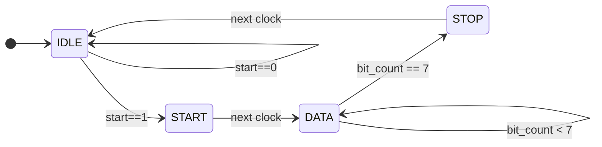

# aa

```mermaid
stateDiagram-v2
    direction LR

    [*] --> IDLE
    IDLE --> START : start==1
    IDLE --> IDLE  : start==0

    START --> DATA : next clock

    DATA --> DATA : bit_count < 7
    DATA --> STOP : bit_count == 7

    STOP --> IDLE : next clock
```